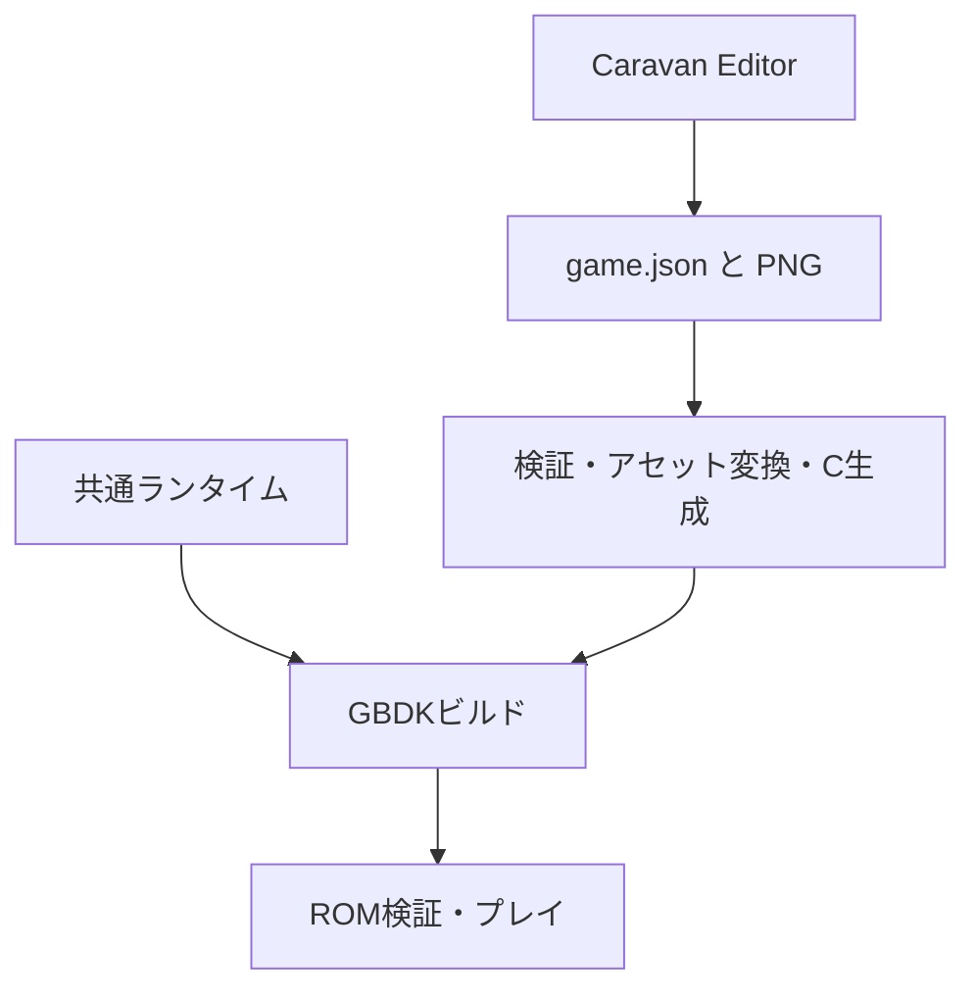

# 開発環境の構成

Caravan Editor、共通GBDKランタイム、作品データ、ポータブルツールを分離します。版と取得元は`config/tools.lock.json`、エディター依存は`editor/package-lock.json`で管理します。

## 制作とビルド

人が編集する原本は`assets-src`です。`generated`のC/H/BIN、`build`のROMやシンボルは再生成します。Cを直接書く作品では`src`と`include`を使用し、`project.json`でビルド対象を指定します。

| ディレクトリ | 責務 |
| --- | --- |
| `editor/src/renderer` | UI、画像編集、論理プレビュー、ROMプレイヤー |
| `editor/src/node` | 作品の読込・保存、検証、コンパイル、IPC |
| `editor/src/shared` | データモデル、制約、論理シミュレーション |
| `engine/caravan` | 入力、敵・弾、描画、音、シーン遷移、SRAM |
| `projects` | 作品ごとの原本とビルド宣言 |
| `scripts` | ツール取得、診断、ビルド、実行、清掃 |
| `.codex/skills/build-gbdk-stg` | AIによる制作ワークフローと補助スクリプト |
| `.tools` / `.downloads` / `.cache` | 取得物と一時データ。Git管理対象外 |

## 実行エンジン

作品ごとの画像・マップ・弾幕・画面はデータとして生成し、同じ`runtime.c`、`render.c`、`music.c`、`save.c`で実行します。エンジンの変更は各作品を再ビルドすると反映されます。作品のルールや演出の有効・無効はゲーム設定で指定します。

ゲーム更新、描画、音、保存の責務を分離し、割込み内では短いハードウェア処理を行います。ゲームロジックとVRAM/OAMへの書込みを混在させません。完成したOAM表示の転送を待ち、負荷が高い場合はゲームの進行を遅くします。

初代Game Boyでは4階調、Game Boy ColorではカラーパレットとCPU倍速を使用します。スコアはMBC5のバッテリーRAMへ2スロット＋CRCで保存します。[SRAM仕様](caravan-sram.md)を参照してください。

## ツールチェーン

GBDKのC／SDAS系アセンブリとRGBDSのRGBASMは別のビルド系統です。構文、オブジェクト形式、ABIを共有する前提で混在させません。GBDK作品は`lcc`をドライバーとして扱います。

標準セットアップはWindows向けです。NodeのコンパイラーAPIはホストの実行ファイル拡張子を解決しますが、Linux/macOS向けの全ツール自動セットアップやElectronアプリ配布は提供していません。

詳しいデータ経路、保存保護、描画仕様は[エディター設計](caravan-editor-architecture.md)、制作規約は[Game Boy実装規約](gb-programming-rules.md)を参照してください。
