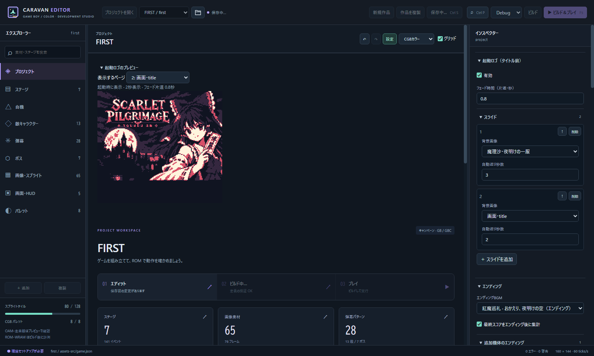

# v0.14 タイトル前の起動ロゴ

[DMG/CGB共通ROM](../projects/touhou-kouma/build/Release/touhou-kouma-v14.gb) — 1MiB、Debug/Release同一。SHA-256: `e45ec8585288597a0cefc30d8f0f3c38becf87f3f03e014213c81127b5a5fe70`

## 使い方

エディターを再起動して touhou-kouma を開き、「プロジェクト」→右の「起動ロゴ（タイトル前）」を設定します。

1. 「画像・スプライト」で160×144の画面画像を用意します。
2. 起動ロゴの「スライドを追加」で画像を選び、各ページの自動送り秒数を指定します。初期値は2秒です。
3. ↑で並べ替え、削除で取り除けます。最大16ページ。同じ画像を複数回使うこともできます。
4. 共通のフェード時間を指定します。初期値は片道0.4秒。「有効」を外すと登録を残したまま表示を止めます。
5. 中央のページ選択で画像を確認し、保存してビルドします。プレビューは保存・ビルドなしで更新されます。

**今回はロゴ素材が未指定なので、作品のリストは空です。画像を登録するまでタイトルから始まります。** 検証用画像を作品へ混ぜていません。

## 動作

電源投入／リセット時に、各ページを黒からフェードイン→指定時間表示→黒へフェードアウトし、全ページ後にタイトルを表示します。表示時間は0.1〜60秒、フェード片道は0.1〜3秒。GBのVBlankとパレット段階に丸めます。既存のステージフェード設定とは独立しています。

A/B/START/SELECT/十字キーのどれでも残りのロゴをまとめてスキップします。フェード中、画像読み込み中の短い入力も受け付けます。スキップボタンを押したままでもタイトルで止まり、新しい入力でゲームを始めます。ランキングやゲーム終了からタイトルへ戻る際には再生しません。

ロゴ画像は共通画面データの後ろに配置するため、既存の会話・エンディング・ボム等の画面番号をずらしません。同じロゴ画像は重複格納しません。追加した状態はRAM5バイト、静的RAM＋OAMは7,002/8,192バイトです。

## 検証

- doctor警告0、hello-gb clean/Debug、test.cmd **86件成功**。star-caravan Debug/Release（128KiB）、touhou-kouma Debug/Release（1MiB）成功。TypeScript確認も成功。
- DMG/CGB **28ケース**で3ページの順序、画像の画素、パレットレジスタと実画面の明るさ変化、表示秒数、全8ボタン、読み込み／フェード中のスキップ、1フレームだけの短押し、押しっぱなし防止を確認しました。ランキング往復での再表示防止と、新しいSTART入力からゲーム開始も確認しました。
- BGB 1.6.6で自動送り・スキップの2ケース。3ページの画像番号、フェード各段階、30/45/60VBlankの表示、タイトル到達を読み取りで確認しました。
- Electron実画面で複数追加、並べ替え、各ページ秒数、フェード0.8秒への編集、プレビュー、保存・再読込を確認しました。
- ロゴ未登録の通常作品ROMでも、両機体×DMG/CGBで最初の道中を操作し、ボス会話へ到達しました。
- 既存画像76ファイル、BGM、ゲーム・エンディング設定を保持。作品定義に追加した項目は startup のみです。旧版ROMも保存しています。

ロゴの動作検証は、2種類の診断画像を3ページに配置した隔離ROMです。実機は未確認です。Emuliciousは接続初期化後にROM launchが60秒でタイムアウトし、実行確認には数えていません。通常難易度の全編クリアは今回の検証に含みません。

[設定](../projects/touhou-kouma/touhou-kouma-design/startup-v14.json) · [検証データ](../projects/touhou-kouma/touhou-kouma-design/qa-v14.json) · [前版のエンディング／BGM](touhou-kouma-v13.md)
