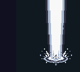

# v0.17 現行エンジンでの再ビルド

[DMG/CGB共通ROM](../projects/touhou-kouma/build/Release/touhou-kouma-v17.gb) — 1,048,576 bytes。Debug／Releaseと実行検証に用いたROMは同一バイト列です。

SHA-256: `875cb1b95f467426222ba016d8b0adacd3fee36185ef54ac62b752e8f91ed340`

エンジン: `28c239642274150b5e5d48dc4afc0e5416149a12`。ゲーム設定のリビジョン: `e078d167f048334e40b2d410f848710e55c5c8b5ca42114d48ab458eb7c53cb2`。

## 今回の反映内容

現在のエンジンで東方 紅魔巡礼 GBを再ビルドしました。`assets-src/game.json`と画像78枚は前版からバイト単位で不変です。機体、弾幕、会話、BGM、エンディング、コンティニューの設定変更は不要でした。プロジェクトIDとSRAM保存形式も維持しています。

新エンジンの`player.bomb.live`は、背景パレットを反転点滅させながらゲームを進める追加方式です。未指定では従来方式を維持するため、本作は霊夢の陰陽玉・魔理沙のスパーク画像を表示し、その間はゲーム進行を止めます。新方式へのゲーム設定変更は行っていません。

操作はA+B、残機ごとに2個、30ダメージ、演出48表示フレーム、2フレームごとの点滅です。生成設定も`ce_bomb_live=0`、画像2種、演出方式0／1であることを確認しました。

## 確認結果

- doctor、hello-gbのclean／Debug、全登録作品のDebug、star-caravanとtouhou-koumaのReleaseビルド成功。標準122テスト成功、失敗0。
- 通常ゲームROMの道中で2機体×DMG/CGBの4ケース。移動速度、ボム画像、点滅、スプライトVRAM保持、残数2→1→0、長押しの再消費防止、残数0での拒否、実際の被弾による次の残機への補充を確認。
- 通常ゲームROMの第1ボスで4ケース。BG弾幕が存在する状態からボムを発動し、弾消去、HP100→70、ボム1個消費、スプライトVRAM保持、BG弾幕の再開を確認。
- 通常ゲームROMのコンティニュー4ケース。残機5→0、機体別ゲームオーバー画像、ランキングのSRAM保存・再読込、同じ機体とステージでスコア0・残機5・ボム2への復帰を確認。
- BGB 1.6.6でも通常ゲームROMをDMG/CGB×2機体で実行。2回の長押し入力がそれぞれ1個だけ消費し、各48表示フレームの演出中はゲーム時計が停止、終了後に再開することを読取りログで確認。
- 静的WRAM＋shadow OAMは7102/8192 bytes、スプライト素材80タイル。コンパイラー診断0、スタック予約1024 bytes以上を維持。

上記の実行検証はゲームデータを変更しない隔離コピーで先行し、最終のDebug／Releaseが同一SHA-256であることを確認しています。短縮ステージやROM・RAMパッチは使用していません。

## 検証資料と制約

[検証結果JSON](../projects/touhou-kouma/touhou-kouma-design/qa-v17.json)、画面・標準ログは`touhou-kouma-design/verification-v17/`へ保存しました。再実行用は`editor/tests/player-bomb.acceptance.mjs`、`kouma-boss-bomb.acceptance.mjs`、`kouma-bomb-native.acceptance.mjs`、`continue-production.acceptance.mjs`です。既存の道中ボム検査は起動ロゴ終了後に開始するよう更新しました。

Emuliciousは起動・DAP接続後のメモリー読取りで`DAPDebugger.evaluate / NullPointerException`が発生し、動作確認には数えていません。実機、通常条件での全7ステージクリア、人による音の確認、今回の性能計測は未実施です。過去の測定を今回のfps保証として扱っていません。

doctor集計は警告0ですが、Gitのユーザー用ignoreファイルへのアクセス警告は発生しています。ビルド／検査のログに残しています。今回、エンジン本体とゲーム元データへの追加修正はありません。
