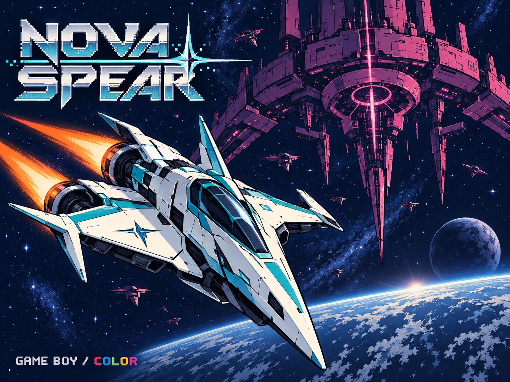

# NOVA SPEAR

ゲームボーイ／ゲームボーイカラー向けのオリジナル縦スクロールSTGです。宇宙の遺跡、巨大戦艦の甲板、暴走炉心へ続く3ステージを、広範囲ショットと集中ショットで突破します。編隊攻撃、横切る迎撃機、装甲砲台、得点用ビーコン、段階的に攻撃を変える大型ボスを収録しています。



既存の商用作品のキャラクター、画像、音楽、ステージデータは使用していません。ゲーム中の画像は編集可能な4色PNGとして作成し、CGBでは役割別の8パレット、DMGでは暗い宇宙に明るい機体が浮かぶ4階調で表示します。

## 起動・編集・ビルド

リポジトリのルートから実行してください。

```bat
editor.cmd nova-spear
```

エディターで素材、敵、弾幕、ボス、ステージ、画面を編集し、保存後に **F5** でビルド＆プレイできます。ゲームの正本は `assets-src/game.json` と `assets-src/images/*.png` です。通常のビルドで初期データへ戻ることはありません。

```bat
build.cmd nova-spear -Configuration Debug
build.cmd nova-spear -Configuration Release
run.cmd nova-spear
```

初回はリポジトリの案内に従って `bootstrap.cmd` と `doctor.cmd` を実行し、GBDKとエミュレーターを準備してください。ROMの出力先はビルド結果に表示されます。

## 操作とルール

| 入力 | 動作 |
| --- | --- |
| 十字キー | 自機移動 |
| Aを押し続ける | TRI PULSE：3方向へ広がる連射 |
| Bを押し続ける | FOCUS LANCE：移動速度を落として高威力の集中連射 |
| START | タイトルで開始／ゲーム中に一時停止・再開 |
| タイトルでSELECT | 上位5件のスコアを見る |

残機は全ステージ共通で5機。被弾すると自機と発射済みの自弾が消え、90ゲームフレーム（60Hz基準で約1.5秒）後に画面下部へ復帰します。その間も敵・背景・制限時間は進み、射撃できないため得点の機会を失います。復帰後は150ゲームフレームの無敵時間があります。処理落ち中はこれらの実時間が長くなります。AとBを同時に押した場合は集中ショットを優先します。背景の構造物は自機の下にある風景なので、接触してもダメージを受けません。

ボスを倒すと暗転して次のステージへ進みます。フェードアウト・インは各24表示フレーム（合計約0.8秒＋読込時間）で、切替演出中はゲーム内の時間を止めます。エディターのゲーム設定で切替フェードを変更でき、既定は有効です。制限時間内にボスを倒せなかった場合も作戦失敗となるため、回避だけではクリアできません。HUDは最上段の1行だけに簡素化しています。`S` は5桁の得点、`P` は残機、`TIME` は3桁の残り秒数です。タイトルとボスHPの表示を省き、プレイ領域を136pxに拡張しました。

| ステージ | 制限時間 | ボス出現 | ボス／HP | 全破壊時の得点上限 |
| --- | ---: | ---: | --- | ---: |
| 01 ORBITAL FRONT | 75秒 | 50秒 | TRIDENT／90 | 15,720 |
| 02 IRON DREADNOUGHT | 90秒 | 60秒 | BASTION／140 | 22,060 |
| 03 NOVA REACTOR | 90秒 | 60秒 | HELIX／200 | 24,400 |

時間は60Hzのゲーム更新を基準にしています。機種や負荷により実時間には差が出る場合があります。ボス出現直前は通常の敵が途切れ、背景のスクロールが遅くなります。ボスは射撃せず接近した後、HPに応じて攻撃を切り替えます。

## 描画と処理落ち

通常プレイは、1回のゲーム更新で作ったスプライト表示をVBlankで転送してから次の更新へ進みます。処理が間に合わない間は前の画面を保持し、ゲーム内の進行を遅くします。描画を間引いて時間へ追いつく方式は使いません。内蔵ROMプレイヤーも通常速度では1回の画面描画につき最大1表示フレームだけ進め、遅延後のまとめ実行を行いません。手動で選ぶ倍速デバッグ再生は例外です。

ゲームロジックはGBDK Cで、スプライトのOAMデータを組み立てる内側のループだけ手書きSM83アセンブラです。負荷が高い場面では更新頻度が下がります。ハードウェアの1走査線10スプライト制限による欠けは、描画フレームの間引きとは別の制約として残ります。

## スコアを伸ばすには

背景は上から下へ流れます。弾を撃たないHP1の **SPARK** 編隊を、1面に50機、2・3面に各70機追加。左右の縦列を時間差で投入し、Aショットで連続撃破できる区間を設けています。SPARKは1機80点、ほかの敵の撃破点は100〜500点。菱形の **NOVA BEACON** は耐久力5の得点用の敵で、破壊すると800点です。拾うアイテムではなく、接触すれば被弾します。1面に3個、2面に4個、3面に5個出現します。

ボスにショットが命中すると、撃破音とは別の短い命中音が鳴ります。

ボスの撃破点は2,200／3,200／5,200点、ステージクリアは各1,500点。すべての敵とビーコンを倒した場合の総得点は **62,180点** です。目標は1面終了時15,000点、2面終了時36,000点、全クリア時60,000点。広範囲ショットで編隊を処理し、装甲機やビーコンには集中ショットを当て続けると得点ルートを作れます。

スコア上位5件はSRAMへ自動保存し、再起動後に読み戻します。ランキングへ入ったゲーム終了時に保存します。2スロット＋CRCで書込み途中の中断や片側破損に備え、両側が無効なら0点から開始します。ROMはMBC5＋8KiB RAM＋バッテリー仕様です。外部エミュレーターではバッテリーセーブ（通常は`.sav`）を保持してください。内蔵ROMプレイヤーも作品ごとに保存し、再読込・アプリ再起動後に復元します。アプリのデータ消去や強制終了直前の未保存分は保持できません。

## 制作データ

- `assets-src/game.json`：エディターで扱うゲーム本体。PNGの画素配列はエディターが読み込みます。
- `assets-src/images/`：自機、敵、ボス、弾、爆発、背景タイル、タイトル・結果画面の原画。
- `assets-src/art/manifest.json`：画像の寸法、発射位置、当たり判定、背景モジュールのタイル番号。
- `assets-src/art/build_art.py`：オリジナルのピクセル原画を再現する手動ツール。
- `assets-src/design/waves.mjs`：初期デザインの敵、弾幕、ボスフェーズ、ステージ出現表。
- `assets-src/design/create_project.mjs`：初期デザインをゲームJSONへ統合する手動ツール。

初期状態を再作成する必要がある場合のみ、リポジトリのルートから次を実行します。`--overwrite` はエディターで加えた変更を初期デザインへ置き換えるため、変更をコミットまたは退避してから使用してください。

```bat
node projects/nova-spear/assets-src/design/create_project.mjs --overwrite
```

生成されたCやROMはビルド成果物です。編集対象は `assets-src` のゲーム設定と原画です。

## 検証

背景方向・雑魚編隊を更新し、44件の自動テストを確認しています。初版では無改造のRelease ROMをDMG/CGBエミュレーションで全3ステージクリアしました。[検証記録](../../docs/nova-spear-validation.md)に条件・結果・未確認事項を記載しています。GitHub Actionsの成功した実行から、`nova-spear-game-boy`でプレイ用ROMを取得できます。

## 性能改善

HUDは値が変化した部分だけを書き換え、直進敵の座標計算とスプライト描画も軽量化しました。過剰な追いつき更新を廃止し、入力・ゲーム更新・描画を毎回組み合わせます。処理がVBlankを越えた場合に、さらに次のVBlankを待ってしまう無駄も除去しています。

GBCではCPU倍速を使用し、内蔵エミュレーターも倍速CPUに対応したフレーム予算で再生します。敵や弾を減らして速くする変更はありません。混雑時の処理落ちは残ります。[性能検証](../../docs/nova-spear-performance.md)に変更前後の測定条件と結果を掲載しています。
